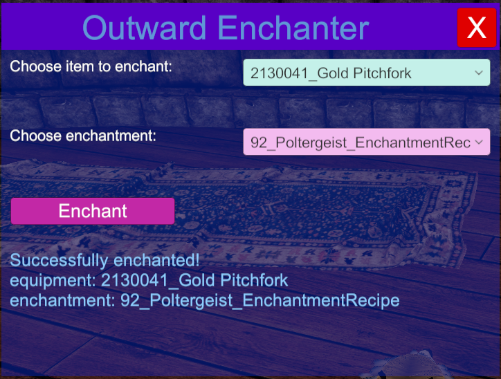

<h1 align="center">
    Outward Enchanter
</h1>
 

  

	
	

This Outward mod allows you to spawn enchanted items easily. It provides a menu and a custom keybinding in the settings to show or hide the menu.

## Why use this mod?

This mod was designed for debugging. If you're creating your own enchantments, you can quickly test them on available equipment.

## How to use

1. Either clone/download the repository with Git or GitHub Desktop, or simply download the code manually.
2. Open `src/OutwardEnchanter.sln` with any C# IDE (Visual Studio, Rider, etc)
3. When you're ready, build the solution. It will be built to the `Release` folder (next to the `src` folder).
4. Take the DLL from the `Release` folder and put it in the `BepInEx/plugins/` folder. If you use r2modman, this can be found by going into r2modman settings and clicking on `Browse Profile Folder`.

### If you liked the mod leave a star it's free
